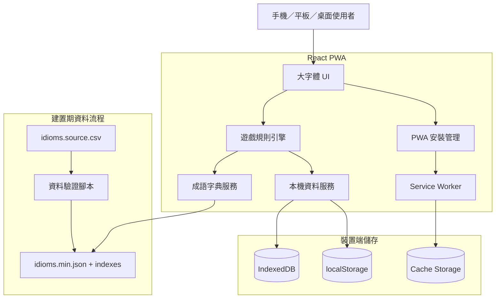
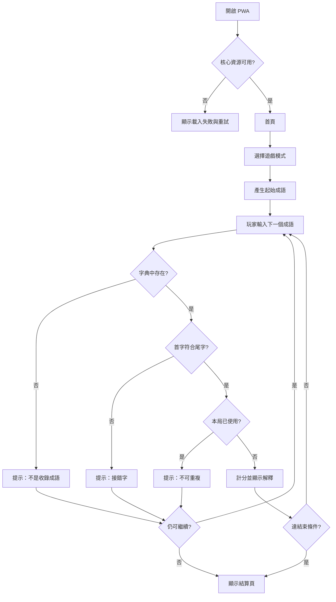
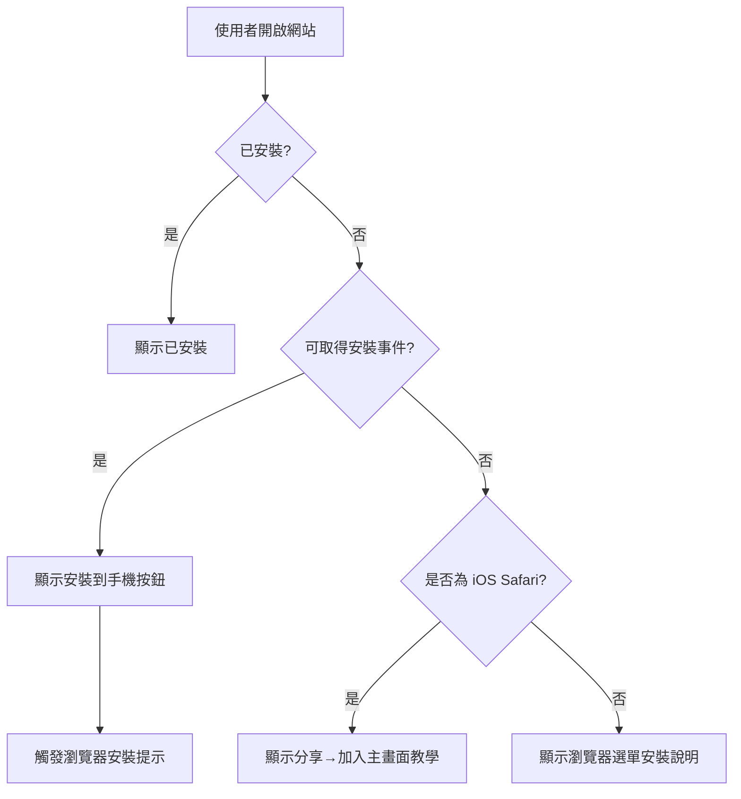

# 中文成語接龍遊戲 - 開發規格書

## 0. 文件資訊

- **文件版本**：v1.0
- **產生日期**：2026-08-05
- **專案定位**：大字體、離線優先、可安裝至手機的繁體中文成語接龍 PWA 遊戲
- **建議版本**：MVP 版
- **適用開發工具**：Gemini、Codex、Antigravity、OpenCode
- **建議技術棧**：React + TypeScript + Vite + Workbox／vite-plugin-pwa + IndexedDB
- **主要裝置**：Android 手機、iPhone、平板、桌面瀏覽器

### 0.1 假設與限制

1. MVP 以單機遊玩為主，不要求註冊、登入、雲端同步、排行榜或多人即時對戰。
2. 接龍判定採「上一個成語的最後一個中文字，必須等於下一個成語的第一個中文字」，不採同音字。
3. MVP 僅收錄經人工整理與授權確認的繁體中文四字成語。
4. 同一局內不可重複使用相同成語。
5. 成語資料庫需包含解釋、注音或拼音、例句、來源與難度欄位；資料不足時可以先留空，但不得由生成式 AI 自動杜撰。
6. PWA 可安裝性會依瀏覽器與作業系統不同：Android/Chrome 可顯示安裝提示；iOS/Safari 需引導使用者透過「分享 → 加入主畫面」。
7. MVP 不含廣告、內購、金流與付費牆。

## 1. 專案分類資訊

- **主分類代碼**：21
- **主分類名稱**：教育學習平台
- **主大類別代碼**：G08
- **主大類別名稱**：平台服務類
- **次分類列表**：
  - 22 App／行動應用：以 PWA 安裝至手機
  - 05 客戶自助服務：玩家自助學習與查詢成語
  - 16 數據分析／儀表板：個人成績與學習統計（進階版）
  - 12 會員系統／社群平台：帳號、排行榜、好友對戰（商用版）
- **複雜度**：中等
- **建議版本**：MVP 版
- **Workflow Key 建議**：`21-chinese-idiom-chain-game-v1.0-A7C9D2`
- **Index Key 建議**：`SY-CICG`
- **Skill Key 建議**：`SK21-CICG`
- **Employee Key 建議**：`EP21-CICG`

## 2. 專案摘要

### 2.1 一句話說明

一款字體大、操作簡單、可離線使用並安裝到手機主畫面的繁體中文成語接龍遊戲。

### 2.2 專案背景

現有成語遊戲常見字體太小、廣告過多、需持續連線，或操作介面不利於長輩與兒童使用。本專案以「看得清楚、按得準、離線也能玩」為核心，將成語接龍設計成低學習門檻的 PWA，使用者以瀏覽器開啟後即可安裝至手機，獲得接近原生 App 的全螢幕體驗。

### 2.3 目標使用者

- 想練習成語的學生與一般使用者
- 希望進行親子共玩或課堂活動的家長、教師
- 需要大字體與高對比介面的中高齡使用者
- 不希望安裝大型 App 或經常連線的使用者

### 2.4 核心價值

- **大字清楚**：主要操作字級不低於 24px，成語顯示以 40px 以上為主。
- **離線可玩**：首次載入完成後，無網路仍可開啟與遊玩。
- **一鍵安裝**：支援 PWA 安裝及 iOS 加入主畫面教學。
- **規則簡單**：依前一成語最後一字，輸入下一個成語。
- **兼具學習**：答題後可查看成語解釋、例句與來源。
- **零 Token 成本**：MVP 不依賴 LLM，避免錯誤解釋與營運成本。

## 3. 產銷人發財分析

### 3.1 產

- 建立可離線運作的成語接龍核心引擎。
- 建立可維護的繁體中文成語資料集。
- 以 PWA 技術同時支援手機、平板與桌面。
- 模組化拆分遊戲規則、字典、儲存、UI 與 PWA 安裝功能。

### 3.2 銷

- 可作為免費教育遊戲、學校教材、品牌公益活動或企業行銷小遊戲。
- 進階版可加入班級活動碼、排行榜與分享卡片。
- 商用版可白牌化，提供學校、補習班或出版社使用。

### 3.3 人

- 玩家：進行成語接龍與查詢學習資料。
- 內容編輯：維護成語、解釋、例句與難度。
- 系統管理員：管理版本、資料匯入與營運設定。
- 教師／活動主持人：商用版可建立題庫與競賽房間。

### 3.4 發

- MVP：單機 PWA、三種遊戲模式、離線資料、安裝引導。
- 進階版：帳號同步、每日任務、學習統計、內容後台。
- 商用版：多人房間、班級管理、排行榜、白牌與營運後台。

### 3.5 財

- 免費版搭配品牌贊助或導流。
- 教育機構採一次性授權或年度訂閱。
- 白牌客製依品牌、資料量與管理功能收費。
- MVP 無第三方 AI 成本，主要成本為開發、維護與資料授權。

## 4. 需求範圍

### 4.1 MVP 版範圍

1. 首頁與大字體模式選擇。
2. 經典模式、限時模式、選擇題模式。
3. 本機成語字典與接龍判定。
4. 即時輸入驗證、錯誤提示、提示功能。
5. 分數、連續答對、剩餘時間與本局紀錄。
6. 成語解釋卡片、例句及來源。
7. 本機保存設定、最佳成績與最近遊戲。
8. PWA Manifest、Service Worker、離線快取、安裝提示。
9. iOS「加入主畫面」操作說明。
10. 響應式介面、鍵盤與觸控操作、無障礙基礎支援。

### 4.2 進階版範圍

1. 會員登入與跨裝置同步。
2. 每日挑戰、成就、徽章、連續登入。
3. 個人學習報告、常錯成語與熟練度分析。
4. 成語收藏、複習清單與錯題本。
5. 內容管理後台與 CSV/JSON 匯入。
6. 分享成績卡片與社群分享。
7. 推播提醒與每日成語。
8. 教師可建立指定字首、主題或難度題組。

### 4.3 商用版範圍

1. 多人即時接龍房間。
2. 班級、群組、賽季與排行榜。
3. 多租戶、品牌白牌、角色權限與稽核日誌。
4. 教師／管理者儀表板。
5. 付費訂閱、授權碼或機構方案。
6. 內容審核、版本發布與回滾。
7. 高可用部署、監控、備份與資安強化。

### 4.4 不包含範圍

- 原生 iOS／Android App 封裝與商店上架。
- MVP 不含聊天、好友、即時多人連線。
- MVP 不含生成式 AI 自動解釋或自動造句。
- MVP 不含廣告 SDK、金流、訂閱與電子發票。
- 不保證收錄所有古籍、俗語、專有名詞或非四字詞語。

## 5. 使用者角色與權限

| 角色 | MVP | 權限 |
|---|---:|---|
| 訪客玩家 | 是 | 遊玩、查看解釋、調整設定、查看本機成績 |
| 已登入玩家 | 進階版 | 雲端同步、收藏、錯題本、跨裝置成績 |
| 內容編輯 | 進階版 | 新增、修改、停用成語與匯入資料 |
| 教師／主持人 | 商用版 | 建立題組、活動與房間、查看班級成績 |
| 系統管理員 | 商用版 | 租戶、權限、版本、稽核、系統設定 |

MVP 不建立伺服器端角色權限，所有資料僅存在目前裝置。

## 6. 核心功能模組

### 6.1 遊戲規則引擎

**模組目的**：統一處理出題、接龍驗證、重複判定、分數與結束條件。

**功能列表**：

- 產生起始成語。
- 驗證是否為資料庫中的有效成語。
- 驗證首字是否等於上一題尾字。
- 驗證本局是否已使用。
- 計算得分、連擊、提示扣分與時間加減。
- 找不到可接成語時結束或重新出題。

**使用流程**：

1. 系統選取具有可接續答案的起始成語。
2. 玩家輸入四字成語或選擇答案。
3. 引擎依「存在性 → 首尾字 → 重複 → 狀態」順序驗證。
4. 正確則計分並更新下一題；錯誤則顯示具體原因。
5. 達到時間、生命值或無可接成語時結束。

**驗收標準**：

- 不存在於字典的詞不得判定正確。
- 首字不符時需於 100ms 內顯示錯誤。
- 同局重複成語不得再次得分。
- 所有模式共用同一驗證服務，不得各自複製規則。

### 6.2 成語字典模組

**模組目的**：提供可靠、可索引、可離線載入的成語資料。

**功能列表**：

- 依首字、尾字、關鍵字與 ID 查詢。
- 提供成語、讀音、解釋、例句、來源、難度與標籤。
- 建立 `firstCharIndex`、`lastCharIndex`，避免每次全表掃描。
- 支援資料版本與校驗碼。

**使用流程**：

1. App 啟動時載入字典索引。
2. 遊戲引擎依尾字查詢可接續候選。
3. 玩家答對後載入該成語詳情。
4. 新版字典部署後由 Service Worker 更新快取。

**驗收標準**：

- 字典載入失敗時不得進入遊戲，需顯示重試與離線說明。
- 任一成語可在 50ms 內完成本機查詢。
- 每筆資料必須有唯一 ID、成語文字與首尾字。

### 6.3 遊戲模式模組

**模組目的**：在共用規則上提供不同難度與節奏。

**功能列表**：

- 經典模式：無限接龍，答錯三次結束。
- 限時模式：60 秒內累積最高分，答對可增加少量時間。
- 選擇題模式：顯示 3 個候選，適合兒童及初學者。
- 難度設定：簡單、普通、困難。

**驗收標準**：

- 模式切換不得改變核心字典資料。
- 限時模式倒數在 App 切到背景時需依真實時間校正。
- 選擇題只能有一個正確答案，錯誤選項不得同時符合接龍規則。

### 6.4 提示與學習模組

**模組目的**：兼顧遊戲性與成語學習。

**功能列表**：

- 顯示可接成語的第二字或完整候選。
- 提示每局有限次數，使用後扣分。
- 答題後顯示簡短解釋。
- 可展開查看讀音、例句與來源。

**驗收標準**：

- 無可用候選時提示按鈕需停用。
- 提示內容只能來自字典，不可即時生成。
- 大字模式下解釋卡片可捲動且不遮住主要操作。

### 6.5 成績與本機儲存模組

**模組目的**：在無帳號情況下保留玩家進度與偏好。

**功能列表**：

- 儲存最佳分數、最長連擊、遊玩次數。
- 儲存音效、震動、字體大小與高對比設定。
- 儲存最近 20 局摘要。
- 支援清除本機資料。

**驗收標準**：

- 重新啟動 App 後設定與最佳分數仍存在。
- IndexedDB 不可用時降級使用 localStorage 儲存基本設定。
- 清除資料需二次確認。

### 6.6 PWA 安裝與離線模組

**模組目的**：讓網站可安裝至手機並在無網路環境遊玩。

**功能列表**：

- Web App Manifest。
- 192×192、512×512、Maskable App Icon。
- Service Worker 預快取 App Shell、字典與必要素材。
- 新版本提示與安全更新。
- Android 安裝按鈕。
- iOS 加入主畫面教學。
- 離線狀態提示。

**驗收標準**：

- 通過瀏覽器 PWA 可安裝性檢查。
- 首次完整載入後，開啟飛航模式仍能啟動並完成一局。
- `display` 使用 `standalone`，從主畫面啟動時不顯示一般瀏覽器工具列。
- 新版資源不得在遊戲進行中強制刷新。

### 6.7 無障礙與大字體模組

**模組目的**：確保兒童、中高齡與視力較弱使用者能清楚操作。

**功能列表**：

- 三段字級：大、特大、超大。
- 高對比模式。
- 可關閉動畫、音效與震動。
- 鍵盤操作與螢幕閱讀器標籤。
- 主要按鈕觸控區至少 48×48 CSS px。

**驗收標準**：

- 主要成語在 360px 寬螢幕上不得截斷。
- 200% 縮放後仍可完成全部核心流程。
- 文字與背景對比符合 WCAG AA。

## 7. 前台頁面規格

### 7.1 啟動畫面

- 顯示 Logo、專案名稱與載入狀態。
- 離線啟動時顯示「離線模式」標籤，不阻斷遊玩。
- 字典損壞或缺失時顯示重新載入按鈕。

### 7.2 首頁

- 主標題：中文成語接龍。
- 主要按鈕：開始遊戲。
- 次要入口：遊戲模式、成語小冊、設定、安裝到手機。
- 首頁主標題建議 48–64px；按鈕文字 24–30px。

### 7.3 模式選擇頁

- 經典模式、60 秒限時、選擇題模式。
- 每種模式使用大圖示、兩行內白話說明。
- 顯示上次與最佳成績。

### 7.4 遊戲頁

- 頂部：返回、模式、分數、時間或生命值。
- 中央：上一個成語，以 44–64px 顯示；最後一字需視覺強調。
- 輸入區：四格大字輸入或單一文字框，輸入字級 36–48px。
- 操作：送出、提示、清除。
- 底部：本局最近 3–5 個成語。
- 錯誤訊息不得只用顏色區分，需有圖示與文字。

### 7.5 答題結果卡片

- 正確：顯示加分、成語解釋與下一題。
- 錯誤：顯示「不是成語／接錯字／已使用」等原因。
- 可設定 1 秒後自動進入下一題，或由使用者按鈕繼續。

### 7.6 結算頁

- 本局分數、答對數、最長連擊、使用提示數。
- 顯示是否刷新個人紀錄。
- 按鈕：再玩一次、換模式、查看本局成語、回首頁。

### 7.7 成語小冊

- 搜尋成語。
- 查看已遇過成語與收藏（收藏列入進階版亦可先本機實作）。
- 詳情包含讀音、解釋、例句、來源與接龍關係。

### 7.8 設定頁

- 字體：大／特大／超大。
- 高對比、減少動畫、音效、震動。
- 清除本機紀錄。
- 版本與字典版本。

### 7.9 安裝說明頁

- Android：顯示「安裝到手機」按鈕；不支援時顯示瀏覽器選單操作。
- iPhone/iPad：顯示「分享 → 加入主畫面」三步圖文說明。
- 已安裝時顯示「已安裝」狀態。

## 8. 後台管理規格

MVP 不建置線上後台，以版本化資料檔管理成語庫。

### 8.1 MVP 資料管理工具

- `idioms.source.csv`：內容編輯來源。
- 建置腳本驗證必填欄位、重複、首尾字與非法字元。
- 輸出最佳化的 `idioms.min.json` 與索引檔。
- 建置失敗時列出錯誤行號與原因。

### 8.2 進階版內容後台

- 成語 CRUD、批次匯入、預覽、發布與回滾。
- 審核狀態：草稿、待審、已發布、停用。
- 欄位級修改紀錄。
- 資料品質儀表板：缺例句、缺來源、孤立首尾字、重複內容。

## 9. AI 功能規格

### 9.1 MVP 原則

MVP **不使用生成式 AI**。成語解釋、例句與來源必須來自人工審核資料，以避免幻覺、錯誤教育內容與 Token 成本。

### 9.2 未來可選 AI 場景

- 將玩家錯誤原因改寫成更淺顯的教學說明。
- 依玩家程度推薦複習清單。
- 對內容編輯提出例句草稿，但不得直接發布。

### 9.3 AI 審核與成本控管

- AI 產生內容預設為草稿，必須經人工審核。
- 記錄模型、Prompt 版本、輸入輸出與審核人。
- 設定每日／每租戶 Token 預算。
- 相同內容優先使用快取。
- 商用版才允許經規則與審核流程後的自動化發布。

## 10. 第三方整合規格

### 10.1 MVP

- 不依賴第三方 API。
- 可選擇加入 Web Share API 分享文字成績；不支援時退回複製文字。
- 可選擇加入匿名錯誤追蹤，但需可關閉並避免收集輸入內容。

### 10.2 進階版

- OAuth/OIDC 登入。
- Web Push 推播。
- 雲端資料庫同步。
- 社群分享卡片產生服務。

### 10.3 商用版

- 學校 SSO、租戶管理、付款與授權系統。
- WebSocket／Realtime 服務支援多人對戰。

## 11. 系統架構



### 11.1 前端模組邊界

- `game-engine`：純函式與狀態機，不依賴 React。
- `idiom-repository`：字典讀取與索引查詢。
- `persistence`：IndexedDB/localStorage 封裝。
- `pwa`：安裝提示、更新與離線事件。
- `ui`：頁面與元件，只透過公開介面操作核心模組。

## 12. 資料庫設計

### 12.1 MVP 本機資料模型

#### `idioms`（建置後唯讀 JSON）

| 欄位 | 型別 | 必填 | 說明 |
|---|---|---:|---|
| id | string | 是 | 唯一識別碼 |
| text | string | 是 | 四字成語 |
| firstChar | string | 是 | 首字 |
| lastChar | string | 是 | 尾字 |
| bopomofo | string | 否 | 注音 |
| pinyin | string | 否 | 拼音 |
| meaning | string | 是 | 簡短解釋 |
| example | string | 否 | 例句 |
| source | string | 否 | 典故或資料來源 |
| difficulty | enum | 是 | easy／normal／hard |
| tags | string[] | 否 | 主題標籤 |
| enabled | boolean | 是 | 是否啟用 |
| version | integer | 是 | 內容版本 |

#### `game_sessions`（IndexedDB）

| 欄位 | 型別 | 說明 |
|---|---|---|
| id | string | UUID |
| mode | string | classic／timed／choice |
| difficulty | string | 難度 |
| startedAt | datetime | 開始時間 |
| endedAt | datetime | 結束時間 |
| score | integer | 分數 |
| correctCount | integer | 答對數 |
| wrongCount | integer | 答錯數 |
| maxCombo | integer | 最高連擊 |
| hintsUsed | integer | 提示次數 |
| result | string | completed／quit／timeout |

#### `game_turns`（IndexedDB）

| 欄位 | 型別 | 說明 |
|---|---|---|
| id | string | UUID |
| sessionId | string | 所屬遊戲 |
| sequence | integer | 回合序號 |
| previousId | string | 上一成語 ID |
| answerId | string/null | 回答成語 ID |
| rawInput | string | 玩家輸入 |
| isCorrect | boolean | 是否正確 |
| errorCode | string/null | 錯誤代碼 |
| scoreDelta | integer | 分數變化 |
| responseMs | integer | 作答時間 |

#### `player_profile`（IndexedDB）

| 欄位 | 型別 | 說明 |
|---|---|---|
| id | string | 固定 local-player |
| totalGames | integer | 總局數 |
| bestScores | object | 各模式最佳分數 |
| encounteredIds | string[] | 已遇過成語 |
| favoriteIds | string[] | 收藏成語 |
| updatedAt | datetime | 最後更新 |

#### `settings`（localStorage）

| 欄位 | 型別 | 預設 |
|---|---|---|
| fontScale | enum | large |
| highContrast | boolean | false |
| reducedMotion | boolean | 依系統設定 |
| soundEnabled | boolean | true |
| vibrationEnabled | boolean | true |
| showMeaningAfterAnswer | boolean | true |

## 13. API 規格草案

MVP 全部使用本機服務介面，先定義與未來 REST API 相同的契約，便於升級。

### 13.1 本機服務介面

```ts
interface IdiomRepository {
  getByText(text: string): Promise<Idiom | null>;
  getById(id: string): Promise<Idiom | null>;
  getCandidatesByFirstChar(char: string): Promise<Idiom[]>;
  getRandomStart(options: StartOptions): Promise<Idiom>;
}

interface GameService {
  createSession(input: CreateSessionInput): Promise<GameSession>;
  submitAnswer(sessionId: string, rawInput: string): Promise<TurnResult>;
  useHint(sessionId: string): Promise<HintResult>;
  endSession(sessionId: string, reason: EndReason): Promise<GameSummary>;
}
```

### 13.2 進階版 REST API

#### `POST /api/v1/game-sessions`

請求：

```json
{
  "mode": "classic",
  "difficulty": "normal"
}
```

回應：

```json
{
  "sessionId": "uuid",
  "startIdiom": {
    "id": "idiom-0001",
    "text": "一心一意",
    "lastChar": "意"
  }
}
```

#### `POST /api/v1/game-sessions/{id}/answers`

請求：

```json
{
  "answer": "意氣風發",
  "clientTimestamp": "2026-08-05T08:00:00Z"
}
```

回應：

```json
{
  "correct": true,
  "scoreDelta": 100,
  "combo": 3,
  "answer": {
    "text": "意氣風發",
    "meaning": "形容精神振奮，氣概豪邁。"
  },
  "nextRequiredChar": "發"
}
```

#### 其他端點

| Method | Path | 用途 |
|---|---|---|
| GET | `/api/v1/idioms/{id}` | 取得成語詳情 |
| GET | `/api/v1/idioms/search?q=` | 搜尋成語 |
| GET | `/api/v1/me/stats` | 個人統計 |
| PUT | `/api/v1/me/settings` | 同步設定 |
| GET | `/api/v1/challenges/daily` | 每日挑戰 |
| POST | `/api/v1/game-sessions/{id}/finish` | 結束遊戲 |

### 13.3 錯誤代碼

| 代碼 | 說明 |
|---|---|
| `IDIOM_NOT_FOUND` | 不在成語字典中 |
| `CHAIN_CHAR_MISMATCH` | 首字與上一成語尾字不符 |
| `IDIOM_ALREADY_USED` | 本局已使用 |
| `NO_AVAILABLE_CANDIDATE` | 無可接續成語 |
| `SESSION_ENDED` | 遊戲已結束 |
| `DICTIONARY_UNAVAILABLE` | 字典未載入或損壞 |

## 14. 主要流程圖

### 14.1 遊戲流程



### 14.2 PWA 安裝流程



## 15. 非功能需求

### 15.1 效能

- 一般 4G 首次載入目標小於 3 秒；已快取啟動小於 1.5 秒。
- 輸入驗證與畫面回饋目標小於 100ms。
- 字典需採索引與分段載入，避免主執行緒長時間阻塞。
- Lighthouse Performance、Accessibility、Best Practices、PWA 指標以 90 分以上為目標。

### 15.2 相容性

- Android：最新兩個主要版本 Chrome、Edge。
- iOS/iPadOS：最新兩個主要版本 Safari。
- Desktop：Chrome、Edge、Safari、Firefox 最新兩個主要版本。
- 不支援 Service Worker 時仍可線上遊玩，但需顯示無法離線安裝提示。

### 15.3 可用性與無障礙

- 主要文字最小 24px；輔助文字最小 18px。
- 主要按鈕高度至少 56px。
- 支援直式 320px 寬至桌面 1440px。
- 所有互動元件具可辨識焦點狀態、ARIA Label 與鍵盤操作。

### 15.4 安全與隱私

- 僅透過 HTTPS 提供正式環境。
- MVP 不收集姓名、電話、Email 或位置。
- 不將玩家輸入送至第三方服務。
- 若加入分析服務，必須匿名化並提供關閉方式。
- 外部字典資料需確認著作權與授權條款。

### 15.5 可維護性

- TypeScript 開啟嚴格模式。
- 核心遊戲引擎測試覆蓋率至少 90%。
- 內容資料與程式碼分離。
- 所有規則常數集中管理，不得散落於 UI。
- 每個 Repository 提供 `.sh` 一鍵啟動與驗證腳本。

## 16. 報價與時程建議

以下為估算級距，不是正式報價；實際金額會受成語資料量、授權、設計精緻度與後端需求影響。

| 版本 | 建議範圍 | 估算報價 | 開發時程 |
|---|---|---:|---:|
| MVP 版 | 單機 PWA、3 模式、離線字典、大字體、安裝 | NT$80,000–160,000 | 4–6 週 |
| 進階版 | 登入同步、成就、錯題本、後台、推播 | NT$180,000–380,000 | 8–12 週 |
| 商用版 | 多租戶、多人對戰、排行榜、白牌、資安 | NT$450,000–900,000+ | 14–24 週 |

### 16.1 MVP 工期拆分

| 階段 | 時程 |
|---|---:|
| 規格與資料格式確認 | 3–4 天 |
| UI/UX 與大字體元件 | 4–6 天 |
| 遊戲引擎與三種模式 | 6–8 天 |
| 字典索引與本機儲存 | 4–6 天 |
| PWA、離線與安裝流程 | 3–5 天 |
| 測試、修正與部署 | 5–7 天 |

## 17. 測試計畫

### 17.1 單元測試

- 正確接龍。
- 錯誤首字。
- 不存在成語。
- 重複成語。
- 無可接續成語。
- 各模式計分與結束條件。
- 提示扣分與次數。
- 背景切換後限時模式校正。

### 17.2 資料品質測試

- 成語文字是否四個中文字。
- ID、文字是否重複。
- `firstChar`、`lastChar` 是否與文字一致。
- 必填解釋是否缺漏。
- 是否存在不合理的不可接續孤島。
- JSON Schema 驗證與校驗碼。

### 17.3 整合測試

- UI 輸入 → 引擎 → 字典 → 結果卡片。
- 結束遊戲 → 保存成績 → 首頁顯示最佳分數。
- Service Worker 更新 → 下一次啟動套用新版。
- IndexedDB 失敗 → localStorage 降級。

### 17.4 E2E 測試

1. 首次開啟並完成一局。
2. 安裝 PWA 後從主畫面啟動。
3. 飛航模式下完成一局。
4. 切換超大字體後完成一局。
5. iOS 安裝說明可正常開啟。
6. 360×640、390×844、768×1024 尺寸無阻斷。

### 17.5 無障礙測試

- 鍵盤完成首頁、選模式、輸入、送出與結算。
- 螢幕閱讀器可讀取目前成語、要求首字與錯誤原因。
- 200% 縮放不重疊。
- 高對比模式與色弱檢查。

## 18. 驗收標準

### 18.1 功能驗收

- 使用者可在手機瀏覽器開啟並開始遊戲。
- 支援至少三種遊戲模式。
- 接龍、重複與字典存在性判定正確。
- 可查看成語解釋與本局結果。
- 設定與最佳成績可保存。

### 18.2 PWA 驗收

- Android 支援瀏覽器可完成安裝。
- iOS 顯示清楚的加入主畫面說明。
- 安裝後可獨立視窗啟動。
- 首次載入後離線可完成核心遊戲。
- Service Worker 更新不會造成進行中遊戲資料遺失。

### 18.3 UI 驗收

- 遊戲主成語預設至少 44px。
- 主要按鈕文字至少 24px、觸控高度至少 56px。
- 360px 寬度無水平捲軸。
- 錯誤資訊同時使用文字與圖示。
- 超大字體模式仍可完成全部流程。

### 18.4 品質驗收

- 核心測試全部通過。
- TypeScript、Lint、Build 無錯誤。
- 核心引擎單元測試覆蓋率至少 90%。
- 正式站使用 HTTPS。
- 無高風險依賴漏洞。
- 成語資料授權與來源紀錄完整。

## 19. 開發任務拆解

### Phase 0：專案初始化

- 建立 React + TypeScript + Vite 專案。
- 設定 ESLint、格式化、測試框架與 CI。
- 建立 `.sh` 一鍵啟動、建置與驗證腳本。
- 建立 PWA Manifest、圖示與基本 Service Worker。

### Phase 1：領域模型與字典

- 定義 `Idiom`、`GameSession`、`TurnResult` 型別。
- 建立 CSV/JSON Schema 與資料驗證腳本。
- 建立首字／尾字索引。
- 匯入第一版經審核成語資料。

### Phase 2：遊戲核心

- 建立純函式驗證器。
- 建立 Game State Machine。
- 實作經典、限時、選擇題模式。
- 實作提示、分數、連擊與結束條件。
- 完成核心單元測試。

### Phase 3：大字體 UI

- 建立 Design Tokens 與三段字級。
- 建立首頁、模式選擇、遊戲、結果、設定頁。
- 建立大尺寸輸入與按鈕元件。
- 建立錯誤、正確與成語解釋卡片。

### Phase 4：儲存與離線

- 建立 IndexedDB Repository。
- 儲存設定、遊戲摘要與最佳成績。
- 設定 App Shell 與字典預快取。
- 完成版本更新與離線提示。
- 實作安裝按鈕及 iOS 教學。

### Phase 5：測試與交付

- E2E、裝置尺寸與離線測試。
- 無障礙與大字體驗收。
- Lighthouse 與效能調校。
- 部署靜態站台。
- 建立 README、維護手冊與資料更新 SOP。

## 20. 給開發工具的實作提示語

```text
你是一位資深 TypeScript、React、PWA 與遊戲系統工程師。請依照《中文成語接龍遊戲 - 開發規格書 v1.0》建立可正式部署的 MVP。

核心目標：
1. 建立繁體中文成語接龍 PWA。
2. 主要字體與按鈕必須適合手機、兒童與中高齡使用者。
3. 首次完整載入後，離線仍可完成一局。
4. Android 可觸發 PWA 安裝；iOS 提供加入主畫面說明。
5. MVP 不使用後端、不使用 LLM、不產生 Token 成本。

技術要求：
- React + TypeScript + Vite。
- 使用 Workbox 或 vite-plugin-pwa。
- IndexedDB 儲存遊戲摘要與玩家紀錄；localStorage 儲存輕量設定與降級資料。
- 核心 game-engine 必須為純 TypeScript 模組，不依賴 React 或瀏覽器 UI。
- 成語資料採版本化 CSV/JSON，建立建置期驗證與首尾字索引。
- TypeScript strict mode、ESLint、單元測試、E2E 測試。
- 提供 start.sh、test.sh、build.sh 或單一 scripts/verify.sh。

開發順序：
A. 先建立領域模型、資料 Schema、字典驗證器與測試。
B. 再以 TDD 建立接龍判定、重複判定、計分與模式狀態機。
C. 建立大字體 Design Tokens、首頁、模式選擇、遊戲與結果頁。
D. 加入 IndexedDB、PWA 安裝、Service Worker、離線及版本更新。
E. 完成 E2E、無障礙、Lighthouse 與離線驗收。

遊戲規則：
- 下一個成語第一字必須與上一個成語最後一字完全相同。
- 僅接受字典中啟用的四字成語。
- 同一局不可重複。
- 驗證順序固定為：正規化輸入 → 字典存在 → 首尾字 → 重複 → 模式狀態。
- 錯誤需回傳明確 errorCode，不得只回傳 false。

UI 要求：
- 遊戲主成語 44–64px。
- 輸入文字 36–48px。
- 主要按鈕文字 24–30px，高度至少 56px。
- 支援大、特大、超大三段字級。
- 360px 寬無水平捲軸，200% 縮放可操作。
- 錯誤不可只用顏色表示。

完成條件：
- 核心遊戲引擎單元測試覆蓋率至少 90%。
- typecheck、lint、test、build、E2E 全數通過。
- 安裝後可用 standalone 模式啟動。
- 飛航模式下可開啟並完成遊戲。
- 不得留下 TODO、假資料接口或未處理錯誤。

請先輸出：
1. Repository 目錄結構。
2. 技術決策與模組邊界。
3. 分階段實作計畫。
4. 第一批失敗測試案例。
取得核准後再開始寫正式程式。
```

## 21. 給開發工具的下一步實作提示語

```text
請以規格書 v1.0 為唯一需求基準，先建立 Phase 0 與 Phase 1：專案骨架、PWA 基礎、領域型別、成語 JSON Schema、CSV 驗證腳本、首尾字索引，以及對應測試。此階段不要先做完整 UI，也不要加入登入、後端、排行榜或 AI 功能。完成後提供檔案清單、執行指令、測試結果與尚未實作範圍。
```
