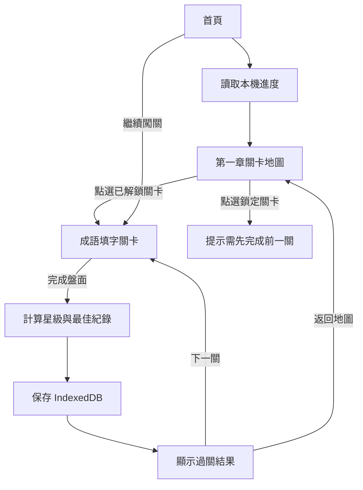

# Phase 5 闖關進度與關卡地圖設計

## 1. 目標

將 Phase 4 的 20 關成語填字，從「每次進入都由第一關開始」升級為可持續遊玩的單機闖關模式。

本階段完成：

- IndexedDB 本機進度保存。
- 第一章 20 關關卡地圖。
- 完成關卡後解鎖下一關。
- 每關 1～3 星評價與最佳紀錄。
- 首頁可繼續上次關卡。
- 可重玩已解鎖關卡，但不可開啟鎖定關卡。
- 儲存失敗時仍可遊玩，並清楚顯示「本次進度可能無法保存」。

不包含：登入同步、雲端備份、多裝置同步、排行榜、每日任務、付費解鎖或第二章關卡。

## 2. 方案選擇

### 方案 A：localStorage JSON

優點是實作最少；缺點是同步 API、資料演進與多章節擴充能力較弱。

### 方案 B：原生 IndexedDB＋純函式進度引擎（採用）

將進度規則與瀏覽器儲存分離。領域層負責星級、解鎖、最佳紀錄與資料正規化；IndexedDB adapter 只負責讀寫。無新增正式環境依賴，後續可自然擴充第二章或歷史紀錄。

### 方案 C：Dexie 等 IndexedDB 套件

API 較簡潔，但目前只有單一 campaign record，不值得增加正式環境依賴。

## 3. 使用者流程

## 4. 領域模型

### 4.1 LevelProgress

每關只保存最佳結果與累積完成次數：

- `levelId`
- `completed`
- `stars`：最佳星級，1～3。
- `bestScore`：最高分。
- `bestMistakes`：最少錯誤數。
- `bestHintsUsed`：最少提示數。
- `completionCount`
- `firstCompletedAt`
- `lastCompletedAt`

### 4.2 CampaignProgress

- `schemaVersion: 1`
- `campaignId: chapter-1`
- `highestUnlockedLevel`：1～20。
- `lastPlayedLevel`：1～20。
- `levelProgressById`
- `updatedAt`

總星數由各關最佳星級即時計算，不另外持久化，避免重複資料不一致。

## 5. 星級與解鎖規則

### 星級

- 三星：`hintsUsed === 0` 且 `mistakes === 0`。
- 二星：`hintsUsed <= 1` 且 `mistakes <= 2`。
- 一星：完成關卡但未達二星條件。

### 解鎖

- 第 1 關永遠解鎖。
- 完成第 N 關後解鎖第 N+1 關。
- 最高解鎖關卡只增加、不倒退。
- 第 20 關完成後保持第 20 關為最高解鎖關卡。
- 重玩已完成關卡，只在星級、分數、錯誤數或提示數更佳時更新最佳紀錄。

## 6. 元件與模組邊界

### `src/domain/progress.ts`

只定義進度資料、完成結果與 repository contract，不依賴 React 或 IndexedDB。

### `src/progress/progress-engine.ts`

純函式：

- 建立初始進度。
- 驗證／正規化持久化資料。
- 判斷關卡是否解鎖。
- 記錄開始遊玩。
- 記錄完成結果。
- 計算星級、總星數與繼續關卡。

### `src/progress/indexeddb-progress-repository.ts`

- Database：`cicg-progress`
- Version：`1`
- Object store：`campaigns`
- Key：`chapter-1`
- 提供 `load`、`save`、`clear`。
- 不在 adapter 內實作星級或解鎖商業規則。

### `src/app/use-campaign-progress.ts`

管理非同步讀取、保存狀態與錯誤訊息；儲存失敗時保留記憶體內最新進度，遊戲不中斷。

### `src/app/LevelMap.tsx`

顯示 20 關、鎖定狀態、星數、總星數與繼續按鈕。僅透過 props 接收資料，不直接讀寫 IndexedDB。

### `src/app/PuzzleGame.tsx`

改為受控關卡入口：接收初始關卡、完成 callback、返回地圖 callback。關卡完成時只回報一次結果。

## 7. 錯誤處理

- IndexedDB 不存在、被瀏覽器封鎖或交易失敗：建立初始／記憶體進度，顯示警告但允許遊玩。
- 儲存資料格式錯誤或版本不支援：忽略損壞資料並回到初始進度。
- `lastPlayedLevel` 或 `highestUnlockedLevel` 超出 1～20：正規化到合法範圍。
- 鎖定關卡的 UI 與 handler 都必須拒絕開啟，不能只靠 disabled 樣式。
- 重複觸發 React effect 不得重複增加 `completionCount`。

## 8. 測試策略

### 純函式測試

- 初始進度只解鎖第一關。
- 三種星級門檻。
- 完成關卡解鎖下一關。
- 第 20 關不越界。
- 重玩不覆蓋較佳星級／分數。
- 最低錯誤與最低提示正確保存。
- 總星數計算。
- 異常持久化資料正規化。
- 鎖定關卡不可開啟。

### Repository 測試

抽出序列化資料解析函式做 Node 測試；IndexedDB browser adapter 的完整實機測試留到後續 Playwright／PWA E2E 階段。

### 回歸驗證

- 既有 49 項測試全部保留。
- TypeScript、ESLint、Shell、成語資料建置與 PWA production build 必須通過。

## 9. 驗收標準

1. 首次開啟顯示第 1 關解鎖，其餘鎖定。
2. 完成第 1 關後，第 2 關立即可開啟。
3. 重新整理頁面後，解鎖與星級仍存在。
4. 關卡地圖可查看每關最佳星級。
5. 首頁「繼續闖關」進入最後遊玩且已解鎖的關卡。
6. 重玩低分結果不覆蓋較佳紀錄。
7. IndexedDB 儲存失敗時遊戲仍可進行，並顯示儲存警告。
8. 所有 CI Gate 完整通過後才可合併 `main`。

## 10. 後續擴充

Phase 6 可在不修改本階段 repository contract 的前提下增加：第二章、關卡獎章、每日挑戰、成語小冊與雲端同步 adapter。
